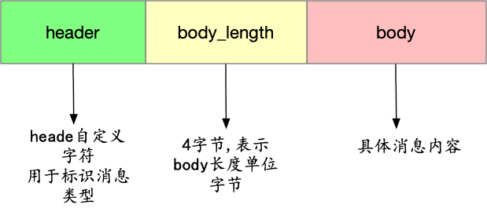

# Tcp粘包问题


```
package protocol

import (
	"bytes"
	"encoding/binary"
	"errors"
	"io"
)

const (
	HEAD_SIZE = 4
	HEADER    = "socket-cluster"
	// The maximum length of each message (including headers), which can be set to 4G
	MAX_LENGTH = 1024 * 70
)

var ExceededErr = errors.New("The maximum length of the packet is exceeded")
var HeaderErr = errors.New("The message header is incorrect")

type FlowProtocol struct {
	Proto
	header     string
	headLength int
	bufLength  int
	start      int
	end        int
	buf        []byte
	conn       io.Reader
}

func NewFlowProtocol(header string, bufLength int, conn io.Reader) *FlowProtocol {
	return &FlowProtocol{
		header:     header,
		headLength: len(header) + HEAD_SIZE,
		bufLength:  bufLength,
		buf:        make([]byte, bufLength),
		conn:       conn,
	}
}

// Read Read and parse the received message
func (this *FlowProtocol) ReadMsg() ([]byte, error) {
	// read header
	for this.end-this.start < this.headLength {
		// reset start
		if this.start > 0 {
			copy(this.buf, this.buf[this.start:this.end])
			this.end -= this.start
			this.start = 0
		}
		n, err := this.conn.Read(this.buf[this.end:])
		if err != nil {
			return nil, err
		}
		this.end += n
	}

	headBuf := this.buf[this.start : this.start+this.headLength]
	// Verify that the message header is correct
	if string(headBuf[:len(this.header)]) != this.header {
		return nil, HeaderErr
	}

	// read content
	contentSize := int(binary.BigEndian.Uint32(headBuf[len(this.header):]))
	totalLenth := this.headLength + contentSize
	if totalLenth > this.bufLength {
		return nil, ExceededErr
	}
	for this.end-this.start < totalLenth {
		n, err := this.conn.Read(this.buf[this.end:])
		if err != nil {
			return nil, err
		}
		this.end += n
	}
	this.start += this.headLength
	contentBuf := this.buf[this.start : this.start+contentSize]
	this.start += contentSize
	return contentBuf, nil
}

// Pack Package raw data
func (this *FlowProtocol) Pack(data []byte) ([]byte, error) {
	headSize := len(data)
	if headSize+this.headLength > this.bufLength {
		return nil, ExceededErr
	}
	var headBytes = make([]byte, HEAD_SIZE)
	binary.BigEndian.PutUint32(headBytes, uint32(headSize))
	var buf bytes.Buffer
	buf.Write([]byte(this.header))
	buf.Write(headBytes)
	buf.Write(data)
	return buf.Bytes(), nil
}
```
